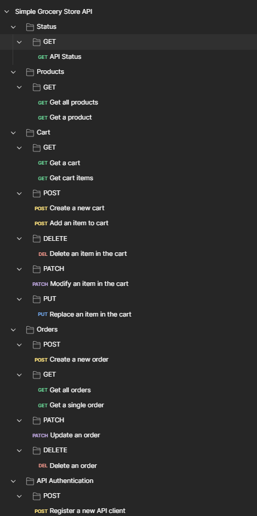

# Simple Grocery Store API
### API project for a conventional supermarket system that simulates the purchase of products through a virtual cart that will be ready for pickup in the store with Postman.

#### Description:

The API project called <b>Simple Grocery Store API</b> is a conventional supermarket system in virtual format that allows you to perform some of the everyday tasks that all supermarket commercial establishments carry out on a daily basis as described below:

- Tasks focused on system products; 
- Tasks focused on Registration and Authentication in the system; 
- Tasks related to a shopping cart; 
- Tasks focused on ordering each item in a shopping cart.   

The virtual shopping cart will then be ready for collection at the store.

#### Features:

The API  Simple Grocery Store API  has several endpoints for each service made available and through these endpoints, several tests were carried out in the Postmam tool following the API Documentation, which must always be made available together with its API.

The Endpoints along with all details of the API Documentation are made available as follows:

- **Status**
- **Products**
- - **Get all products**
- - **Get a product**
- **Cart**
- - **Get a cart**
- - **Get cart items**
- - **Create a new cart**
- - **Add an item to cart**
- - **Modify an item in the cart**
- - **Replace an item in the cart**
- - **Delete an item in the cart**
- **Orders**
- - **Get all orders**
- - **Get a single order**
- - **Create a new order**
- - **Update an order**
- - **Delete an order**
- **API Authentication**
- - **Register a new API client**

#### Image:

#### Credits:
This project made in Postman was based on the following course:
- https://www.udemy.com/course/postman-the-complete-guide/

The API Documentation is based on the following link:
- https://github.com/vdespa/Postman-Complete-Guide-API-Testing/blob/main/simple-grocery-store-api.md

This project was created by **Alexandre Rodrigues da Silva**.